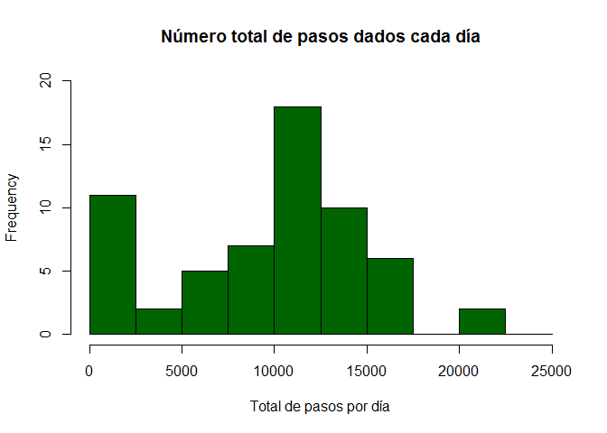
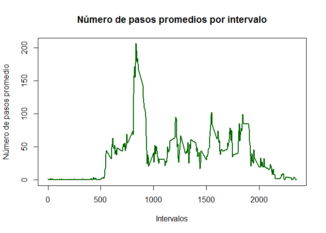
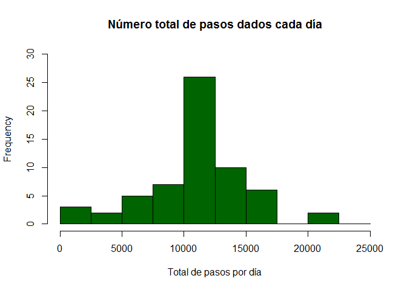
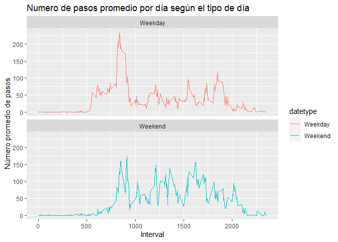

```r
knitr::opts_chunk$set(warning=FALSE)
```

# Cargando y preprocesando los datos


```r
library(ggplot2)

activity <- read.csv("activity.csv")

activity$date <- as.POSIXct(activity$date, "%Y-%m-%d")
weekday <- weekdays(activity$date)
activity <- cbind(activity,weekday)
```

# ¿Cuál es el número total medio de pasos dados por día?

Agrupamos por fecha para obtener el total de pasos por dia

```r
total_steps <- with(activity, aggregate(steps, by = list(date), FUN = sum, na.rm = TRUE))
names(total_steps) <- c("date", "steps")
```

Realizamos el histograma

```r
hist(total_steps$steps, main = "Número total de pasos dados cada día", xlab = "Total de pasos por día", col = "darkgreen", ylim = c(0,20), breaks = seq(0,25000, by=2500))
```

<!-- -->

Calculamos la media del número total de pasos dados por día


```r
mean(total_steps$steps)
```

```
## [1] 9354.23
```

Calculamos la mediana del número total de pasos dados por día


```r
median(total_steps$steps)
```

```
## [1] 10395
```

# ¿Cuál es el patrón de actividad diaria promedio?

Gráfica de series de tiempo del intervalo de 5 minutos (eje x) y el número medio de pasos dados, promediado en todos los días (eje y)


```r
## Promedio de la actividad diaria
ave_daily_act <- aggregate(activity$steps, by=list(activity$interval), FUN=mean, na.rm=TRUE)
names(ave_daily_act) <- c("interval", "mean")

## Generamos la grafica
plot(ave_daily_act$interval, ave_daily_act$mean, type = "l", col="darkgreen", lwd = 2, xlab="Intervalos", ylab="Número de pasos promedio", main="Número de pasos promedios por intervalo")
```

<!-- -->

¿Qué intervalo de 5 minutos, en promedio para todos los días del conjunto de datos, contiene el número máximo de pasos?


```r
ave_daily_act[which.max(ave_daily_act$mean), ]$interval
```

```
## [1] 835
```

# Imputación de valores perdidos

Calculamos el número total de valores faltantes


```r
sum(is.na(activity$steps))
```

```
## [1] 2304
```

Completando los valores faltantes con el promedio de pasos diarios


```r
imputed_steps <- ave_daily_act$mean[match(activity$interval, ave_daily_act$interval)]
```

Creando el nuevo conjunto con los valores faltantes completados


```r
activity_imputed <- transform(activity, steps = ifelse(is.na(activity$steps), yes = imputed_steps, no = activity$steps))
total_steps_imputed <- aggregate(steps ~ date, activity_imputed, sum)
names(total_steps_imputed) <- c("date", "daily_steps")
```

Histograma del número total de pasos dados cada día


```r
hist(total_steps_imputed$daily_steps, col = "darkgreen", xlab = "Total de pasos por día", ylim = c(0,30), main = "Número total de pasos dados cada día", breaks = seq(0,25000,by=2500))
```

<!-- -->

Calculamos la media del número total de pasos dados cada día


```r
mean(total_steps_imputed$daily_steps)
```

```
## [1] 10766.19
```

Calculamos la mediana del número total de pasos dados cada día


```r
median(total_steps_imputed$daily_steps)
```

```
## [1] 10766.19
```

# ¿Existen diferencias en los patrones de actividad entre los días de semana y los fines de semana?

Creando una nueva variable de factor en el conjunto de datos con dos niveles: "día de la semana" y "fin de semana", indicando si una fecha determinada es un día de la semana o un día de fin de semana.


```r
activity$date <- as.Date(strptime(activity$date, format="%Y-%m-%d"))
activity$datetype <- sapply(activity$date, function(x) {
        if (weekdays(x) == "sábado" | weekdays(x) =="domingo") 
                {y <- "Weekend"} else 
                {y <- "Weekday"}
                y
        })
```

Creando un diagrama de panel que contenga un diagrama de serie de tiempo del intervalo de 5 minutos (eje x) y el número medio de pasos dados, promediado entre todos los días de la semana o los fines de semana (eje y). 


```r
activity_by_date <- aggregate(steps~interval + datetype, activity, mean, na.rm = TRUE)
plot<- ggplot(activity_by_date, aes(x = interval , y = steps, color = datetype)) +
       geom_line() +
       labs(title = "Numero de pasos promedio por día según el tipo de día", x = "Interval", y = "Número promedio de pasos") +
       facet_wrap(~datetype, ncol = 1, nrow=2)
print(plot)
```

<!-- -->
